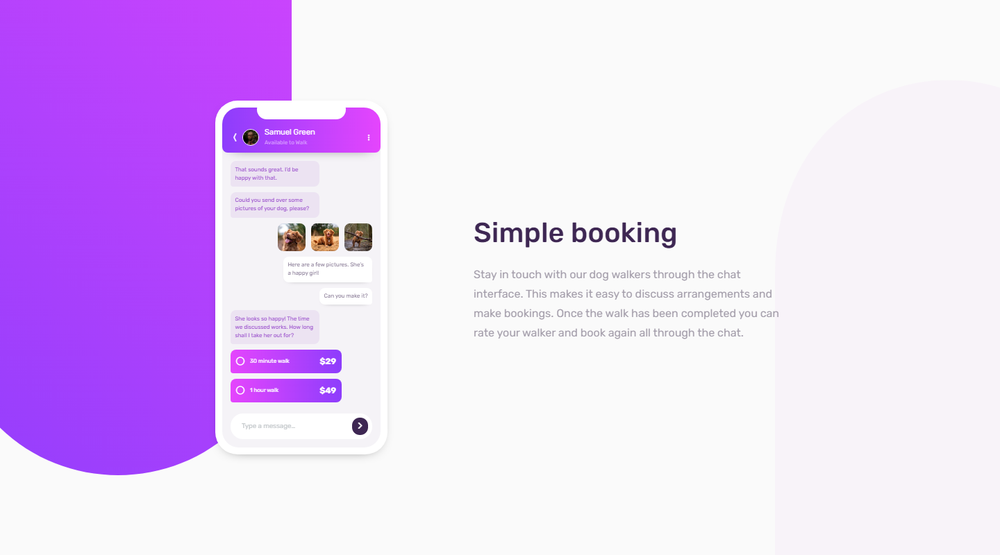

# Frontend Mentor - Chat app CSS illustration solution

This is a solution to the [Chat app CSS illustration challenge on Frontend Mentor](https://www.frontendmentor.io/challenges/chat-app-css-illustration-O5auMkFqY). Frontend Mentor challenges help you improve your coding skills by building realistic projects. 

## Table of contents

- [Overview](#overview)
  - [The challenge](#the-challenge)
  - [Screenshot](#screenshot)
  - [Links](#links)
- [My process](#my-process)
  - [Built with](#built-with)
  - [What I learned](#what-i-learned)
  - [Continued development](#continued-development)
  - [Useful resources](#useful-resources)
- [Author](#author)
- [Acknowledgments](#acknowledgments)

## Overview

### The challenge

Users should be able to:

- View the optimal layout for the component depending on their device's screen size
- **Bonus**: See the chat interface animate on the initial load

### Screenshot



### Links

- Solution URL: [Solution](https://github.com/JustANipple/chat-app-css-illustration/blob/master/style.css)
- Live Site URL: [Live site](https://justanipple.github.io/chat-app-css-illustration/)

## My process

### Built with

- Semantic HTML5 markup
- CSS custom properties
- Flexbox
- CSS Grid
- Mobile-first workflow
- Josh's Custom CSS Reset
- SVG path editor
- Keyframes

### What I learned

1. The first and hardest problem was building backgrounds with linear gradients.
I managed to build a similar block on SVG path editor (https://yqnn.github.io/svg-path-editor/)
Getting used to mask a block with SVG resulted the trickiest and the best solution for my challenge
The trick is to have a block with the gradient background and then applying the mask to it makes everything invisible except the form of the SVG

Here is how i made the left purple-pink background:
```css
.purple-bg {
  -webkit-mask-image: url(images/bg-shape.svg);
  mask-image: url(images/bg-shape.svg);
  -webkit-mask-repeat: no-repeat;
  mask-repeat: no-repeat;
  background: linear-gradient(225deg, rgba(206,68,253,1) 0%, rgba(146,62,252,1) 100%);
  width: 500px;
  aspect-ratio: 4/6.25;
  position: absolute;
  left: -19.75rem;
  top: -17rem;
  z-index: -1;
  transition: left 1s ease-in-out, top 1s ease-in-out;
}
```

2. A minor problem was the overflow of negative positioning of absolute elements, in this case the two backgrounds. To make it possible, i used a position relative on the container (body), and then hidden the overflow-x for mobile view, so i can still scroll vertically and overflow (x and y) for desktop view to make it centered and unscrollable

Mobile view:
```css
html, body {
    height: 100%;
    overflow-x: hidden;
}
```

Desktop view:
```css
  body {
    height: 100vh;
    display: flex;
    justify-content: center;
    align-items: center;
    overflow: hidden;
  }
```


```html
<h1>Some HTML code I'm proud of</h1>
```
```css
.proud-of-this-css {
  color: papayawhip;
}
```
```js
const proudOfThisFunc = () => {
  console.log('🎉')
}
```

If you want more help with writing markdown, we'd recommend checking out [The Markdown Guide](https://www.markdownguide.org/) to learn more.

**Note: Delete this note and the content within this section and replace with your own learnings.**

### Continued development

Use this section to outline areas that you want to continue focusing on in future projects. These could be concepts you're still not completely comfortable with or techniques you found useful that you want to refine and perfect.

**Note: Delete this note and the content within this section and replace with your own plans for continued development.**

### Useful resources

- [Example resource 1](https://www.example.com) - This helped me for XYZ reason. I really liked this pattern and will use it going forward.
- [Example resource 2](https://www.example.com) - This is an amazing article which helped me finally understand XYZ. I'd recommend it to anyone still learning this concept.

**Note: Delete this note and replace the list above with resources that helped you during the challenge. These could come in handy for anyone viewing your solution or for yourself when you look back on this project in the future.**

## Author

- Website - [Add your name here](https://www.your-site.com)
- Frontend Mentor - [@yourusername](https://www.frontendmentor.io/profile/yourusername)
- Twitter - [@yourusername](https://www.twitter.com/yourusername)

**Note: Delete this note and add/remove/edit lines above based on what links you'd like to share.**

## Acknowledgments

This is where you can give a hat tip to anyone who helped you out on this project. Perhaps you worked in a team or got some inspiration from someone else's solution. This is the perfect place to give them some credit.

**Note: Delete this note and edit this section's content as necessary. If you completed this challenge by yourself, feel free to delete this section entirely.**
