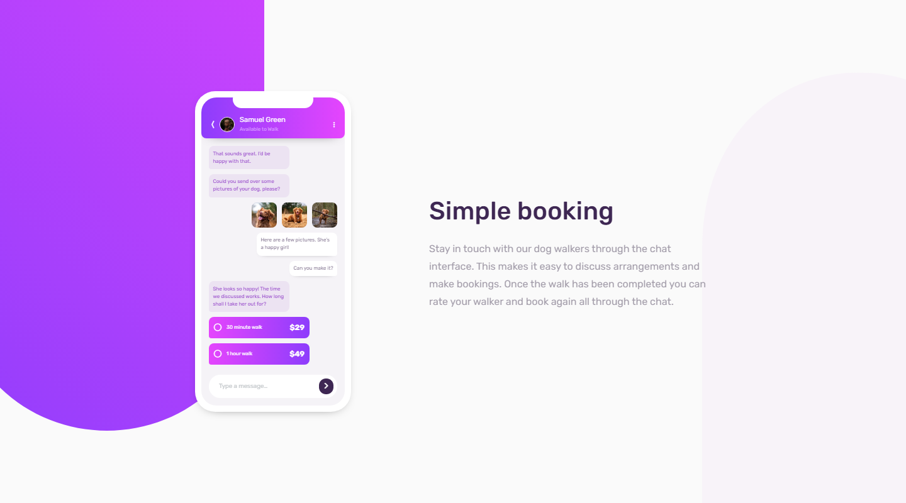

# Frontend Mentor - Chat app CSS illustration solution

This is a solution to the [Chat app CSS illustration challenge on Frontend Mentor](https://www.frontendmentor.io/challenges/chat-app-css-illustration-O5auMkFqY). Frontend Mentor challenges help you improve your coding skills by building realistic projects. 

## Table of contents

- [Overview](#overview)
  - [The challenge](#the-challenge)
  - [Screenshot](#screenshot)
  - [Links](#links)
- [My process](#my-process)
  - [Built with](#built-with)
  - [What I learned](#what-i-learned)
  - [Continued development](#continued-development)
  - [Useful resources](#useful-resources)
- [Author](#author)

## Overview

### The challenge

Users should be able to:

- View the optimal layout for the component depending on their device's screen size
- **Bonus**: See the chat interface animate on the initial load

### Screenshot



### Links

- Solution URL: [Solution](https://github.com/JustANipple/chat-app-css-illustration/blob/master/style.css)
- Live Site URL: [Live site](https://justanipple.github.io/chat-app-css-illustration/)

## My process

### Built with

- Semantic HTML5 markup
- CSS custom properties
- Flexbox
- CSS Grid
- Mobile-first workflow
- Josh's Custom CSS Reset
- SVG path editor
- Keyframes

### What I learned

1. The first and hardest problem was building backgrounds with linear gradients.
I managed to build a similar block on SVG path editor (https://yqnn.github.io/svg-path-editor/)
Getting used to mask a block with SVG resulted the trickiest and the best solution for my challenge
The trick is to have a block with the gradient background and then applying the mask to it makes everything invisible except the form of the SVG

Here is how i made the left purple-pink background:
```css
.purple-bg {
  -webkit-mask-image: url(images/bg-shape.svg);
  mask-image: url(images/bg-shape.svg);
  -webkit-mask-repeat: no-repeat;
  mask-repeat: no-repeat;
  background: linear-gradient(225deg, rgba(206,68,253,1) 0%, rgba(146,62,252,1) 100%);
  width: 500px;
  aspect-ratio: 4/6.25;
  position: absolute;
  left: -19.75rem;
  top: -17rem;
  z-index: -1;
  transition: left 1s ease-in-out, top 1s ease-in-out;
}
```

2. A minor problem was the overflow of negative positioning of absolute elements, in this case the two backgrounds. To make it possible, i used a position relative on the container (body), and then hidden the overflow-x for mobile view, so i can still scroll vertically and overflow (x and y) for desktop view to make it centered and unscrollable

Mobile view:
```css
html, body {
    height: 100%;
    overflow-x: hidden;
}
```

Desktop view:
```css
  body {
    height: 100vh;
    display: flex;
    justify-content: center;
    align-items: center;
    overflow: hidden;
  }
```

3. The arrow to go back on the chat app and the three vertical dots icons i got were wider and taller than the design, but i couldn't find the right ones, so i just played with transform to scale them properly

Chat arrow:
```css
.fa-angle-left {
  color: var(--white-clr);
  transform: scale(1,2);
  font-size: 0.5rem;
}
```

Chat vertical dots:
```css
.fa-ellipsis-vertical {
  margin-left: auto;
  color: var(--white-clr);
  font-size: 0.5rem;
  transform: scale(1,1.25)
}
```

4. Animating the chat was the most satisfying part because i learned to use animations, delays, forwards to keep the scaling and the most important part was keyframes.
With this i controlled the timing to make blocks appear, disappear and keep their scaling

Here is one of the eight blocks of messages i animated. They all work almost the same:
```css
  /* ====== Message one ====== */
.message-one .dots {
  animation: 
  appear 1s ease-in-out 1s forwards,
  disappear 1s ease-in-out 2s forwards;
}

.message-one .text {
  animation: appear 1s ease-in-out 3s forwards;
}
```

### Continued development

Animations have been a wonderful discover, so i'd like to learn more on that
I've had a hard time working with masks, but i understand they have potential to produce creative ideas, so i will try to learn more about those

### Useful resources

- [Path editor](https://yqnn.github.io/svg-path-editor/) - With this free tool i managed to create backgrounds
- [Negative overflow](https://stackoverflow.com/questions/4605715/position-absolute-and-overflow-hidden) - This reminded me that i should've used a position relative to the container that had to hide the overflow of backgrounds (in this case is body)
- [Icons scaling](https://developer.mozilla.org/en-US/docs/Web/CSS/transform-function/scale) - Here i found a nice explanation to scale my arrow and vertical dots to fit the design i was given
- [Keyframes guide](https://www.joshwcomeau.com/animation/keyframe-animations/) - With this so useful guide of Josh Comeau i learned how to use keyframes to animate my chat.

## Author

- Frontend Mentor - [@JustANipple](https://www.frontendmentor.io/profile/JustANipple)
